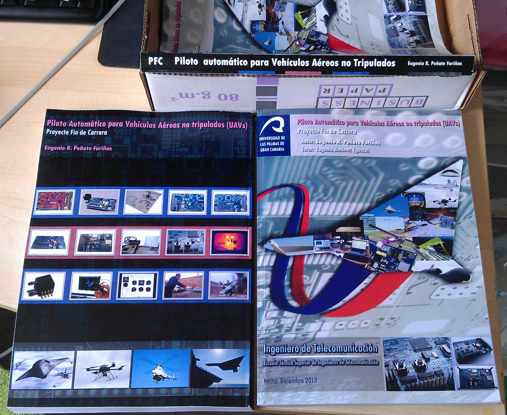

MemoriaPFC
==========

Documentación en Español del proyecto fin de carrera:
Piloto Automático para UAVs.
Diseñado por:
Eugenio Peñate

Para hacerse una idea rápida del proyecto:
http://prezi.com/pihnkbubvtzk/uav-autopilot-eng-full/

Videos de tests en:
https://www.youtube.com/user/epf2k

Video de hardware debugging de la arquitectura software en tiempo real:
http://www.youtube.com/watch?v=3RP8rK31rrw&list=PLYa-Frja0QOAoAs2c9jvUxYckPELOwPwg&index=5

<table>
<tr>
<td>

</td>
</tr>
</table>

<table>
<tr>
<td>

</td>
<td>

</td>
</tr>

</table>
